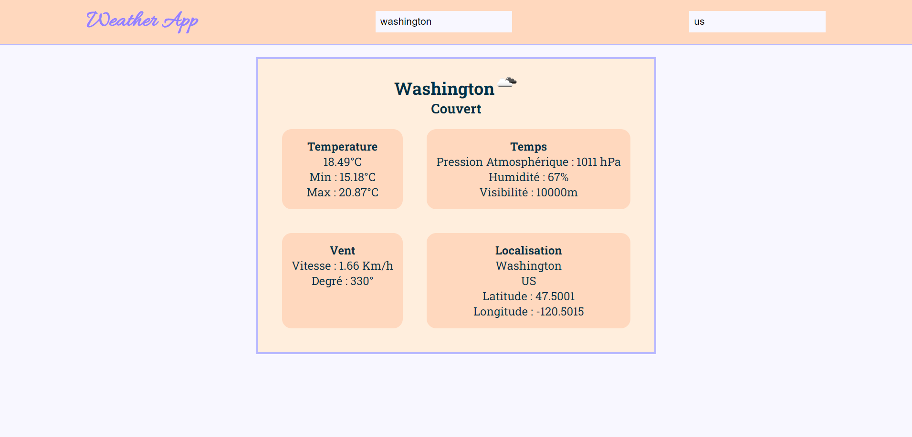

# Weather App

## Description

L'application Weather App vous permet d'obtenir les détails météorologiques d'une ville précise. Elle utilise l'API OpenWeatherData pour récupérer les données météorologiques en temps réel. Voici comment vous pouvez utiliser cette application :

## Fonctionnalités

- Recherche de la météo : Vous pouvez rechercher la météo d'une ville en spécifiant son nom. L'application récupère les informations météorologiques correspondantes de l'API OpenWeatherData.

- Affichage des détails météo : Une fois que vous avez effectué une recherche, l'application affiche les détails météorologiques de la ville, tels que la température, l'humidité, la vitesse du vent, etc.

## Prérequis

Avant de pouvoir utiliser cette application, assurez-vous d'avoir les éléments suivants :

- Node.js installé sur votre machine
- Un navigateur web compatible

## Guide d'installation

1. Clonez le dépôt de l'application depuis GitHub : `git clone https://github.com/Matteo-CB/weather-app.git`

2. Accédez au répertoire de l'application : `cd weather-app`

3. Installez les dépendances requises en exécutant la commande suivante : `npm i`

4. Lancez l'application en exécutant la commande : `npm start`

5. Ouvrez votre navigateur et accédez à l'URL suivante : `http://localhost:3000`

Vous devriez maintenant voir l'application Weather App et pouvoir commencer à l'utiliser.

## Limitations

Veuillez noter les limitations suivantes de cette application :

- Les données météorologiques disponibles dépendent de l'API OpenWeatherData. Par conséquent, la disponibilité et l'exhaustivité des informations peuvent varier.

- L'application nécessite une connexion Internet active pour récupérer les données météorologiques en temps réel.

